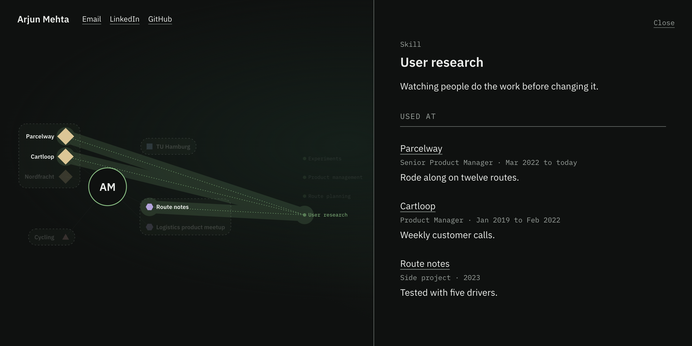

# resume-hypergraph

Turn your resume into an interactive web page that shows where you used each skill.

**Live example:** [varunmoka.com](https://varunmoka.com), the site this tool grew out of.
**More examples (made-up people):** https://resume-hypergraph.vercel.app

## Why

A resume lists your skills in one place and your jobs in another. It does not show which skill
you used where. This page does. You sit in the centre, your jobs, studies and projects sit
around you, and every skill is connected to the places you used it.

### For job seekers

- **Shows proof for every skill.** Each skill links to the jobs, studies and projects where you
  used it, with one sentence on what you did there.
- **One link to share.** You get a single web page to put on your own site and link from your
  CV, LinkedIn profile or applications.
- **Says only what your resume says.** Nothing is invented, and a number that is not in your
  resume stops the page from being built.
- **Keeps private details out.** Phone number, home address and date of birth are left off the
  page.
- **Free.** Open source, no account, no subscription.

### For recruiters and hiring managers

- **Click a skill** to see every place the candidate used it and what they did there, without
  searching the whole resume.
- **Click an employer or school** to see what the organisation does, the candidate's role and
  dates, and the work they did.
- **Opens in any browser.** On a phone the same content is shown as a simple list.

## Quick start

You need an AI coding assistant. The steps below are for
[Claude Code](https://claude.com/claude-code). Other tools are listed further down.

1. Install the plugin. Inside Claude Code, run:

       /plugin marketplace add varunmoka7/resume-hypergraph
       /plugin install resume-graph@resume-hypergraph

2. Open the folder that holds your resume (PDF, Word or text).

3. Say: **"turn my resume into a graph"**

It asks no questions. A short resume takes a few minutes. When it finishes, the page opens in
your browser and you have a new folder, `resume-graph/`, with two files:

| File | What it is |
|---|---|
| `index.html` | Your page. Upload it to any web host to put it online. |
| `profile.json` | The data behind the page. Edit it, or ask the assistant to, and rebuild. |

To name the file yourself: `/resume-graph:resume-graph my-cv.pdf`

## Other tools

| Tool | How to install |
|---|---|
| Claude on the web | Download [resume-graph.zip](https://github.com/varunmoka7/resume-hypergraph/releases/latest/download/resume-graph.zip) and upload it under Settings, Capabilities, Skills. Then share your resume in a chat and ask for a graph. Not yet tested there. |
| Codex | `sh scripts/pack-skill.sh`, then `cp -R dist/resume-graph ~/.codex/skills/` |
| Gemini CLI | `gemini extensions install https://github.com/varunmoka7/resume-hypergraph` |
| Cursor and others | Clone this repo, open it in the tool and say "turn my resume at ~/cv.pdf into a graph". `AGENTS.md` tells it what to do. |
| Tools with a skills folder | `sh scripts/pack-skill.sh`, then copy `dist/resume-graph` into the folder (`~/.agents/skills/` is common). |
| No AI tool | Write `profile.json` by hand (format: `skills/resume-graph/PROFILE-FORMAT.md`) and run `node scripts/profile.mjs build my-profile.json index.html` |

## How it works

1. **Read.** Reads the resume and sorts every entry into a group: work, education, projects,
   awards and so on.
2. **Research.** Looks up each employer and school on the web and writes a one-line description
   with a link to its source.
3. **Logos.** Fetches each organisation's logo from its own website.
4. **Skills.** Picks the skills and writes one sentence for each place a skill was used.
5. **Check.** A script validates the data, and a second assistant that has not seen the drafts
   checks every sentence against the resume.
6. **Build.** Writes one HTML file and opens it.

## What it will not do

- **Invent.** Sentences about you come from your resume. The build fails if one of them
  contains a number your resume does not.
- **Publish private details.** Phone, street address, date of birth, marital status and
  references are left out. Profile links printed on the resume, such as LinkedIn or GitHub, are
  kept. Your email address is added only if you say yes.
- **Guess about organisations.** If it cannot find an employer or school, it leaves the
  description out.
- **Upload anything.** It builds a file on your computer. Putting it online is your decision.

## Privacy

There is no server behind this tool. Your resume is read by the AI assistant you run it in,
under that assistant's own terms. The tool adds only the lookups for the organisations named on
your resume: a web search, a visit to each organisation's website, and a request to Google's
favicon service when a site has no logo of its own.

## The page

- One HTML file: plain HTML, CSS and JavaScript, no frameworks, no build step.
- Fonts are embedded, so the page loads nothing from other sites.
- Works on any static host, or inside an existing page through an `<iframe>`.
- Long sections fold into a "+ N more" row.
- A small "Made with resume-hypergraph" link sits in one corner. Set `"credit": false` in
  `profile.json` to remove it.

## Commands

In Claude Code every step is also available on its own, for redoing part of a graph.

| Command | Step |
|---|---|
| `/resume-graph:resume-graph` | All six steps |
| `/resume-graph:read` | Read the resume, sort entries into groups |
| `/resume-graph:company` | Research one organisation and write that entry's panel |
| `/resume-graph:skills` | Choose the skills and write one sentence per place used |
| `/resume-graph:check` | Check every sentence against the resume |
| `/resume-graph:publish` | Build the page |

## Development

Requires Node 18 or later. There are no dependencies to install.

    python3 scripts/serve.py 8131      # preview at http://localhost:8131/view/
    node --test scripts/               # tests for the check and the build

`?p=short` and `?p=long` load the other sample profiles. All sample people and companies are
made up.

| Path | What |
|---|---|
| `view/` | The page: `index.html`, `graph.js`, `style.css`, the fonts, sample data |
| `skills/` | The skill and its steps |
| `agents/` | The two agents the skill starts: one profiles an entry, one checks the result |
| `AGENTS.md` | Instructions for Codex, Gemini CLI and other agents |
| `examples/` | A made-up resume to try it on |
| `scripts/profile.mjs` | Checks a data file and builds the one-file page |
| `scripts/profile.test.mjs` | Tests for the check and the build |
| `scripts/check-layout.py` | Loads every sample at four screen sizes, fails on overlapping labels |
| `research/` | Notes on resume sections across professions and on existing resume formats |
| `docs/` | The picture used in this README and in link previews |

## Status

First release. It has run from start to finish in Claude Code and in Codex. The Claude web and
Gemini CLI routes have not been tried yet.

Issues and pull requests are welcome. If the tool trips on your resume, describe the section
that broke and leave private details out of the report.

## License

MIT. The fonts are IBM Plex, under the SIL Open Font License (`view/fonts/OFL.txt`). Logos in a
built page belong to their organisations.
